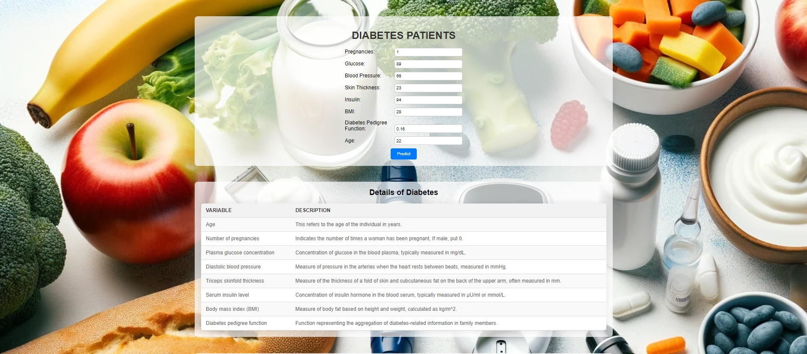

# **Diabetes Patient Project**

---

### Overview

The Diabetes Patient Project aims to develop a machine learning model to predict whether a patient has diabetes based on various health indicators. This project involves importing data, performing exploratory data analysis (EDA), splitting the data into training and testing sets, building and testing multiple machine learning algorithms, and selecting the best-performing model for deployment.

### Stages of the Project

1. **Importing Libraries**: Import necessary Python libraries such as pandas, numpy, seaborn, matplotlib, scikit-learn, etc.

2. **Importing Data**: Load the dataset containing patient health data.

3. **Exploratory Data Analysis (EDA)**:
   - Visualize the distribution of features using histograms
   - Explore correlations between features using a heatmap 

4. **Splitting Data**: Split the dataset into training and testing sets.

5. **Building and Testing Models**: Implement and evaluate five different machine learning algorithms on the data to determine the best-performing model. The algorithms considered are:
   - Logistic Regression
   - Random Forest Classifier
   - Decision Tree Classifier
   - XGBoost Classifier
   - Support Vector Classifier (SVC)

6. **Grid Search for Hyperparameter Tuning**: Perform grid search for hyperparameter tuning for each classifier to optimize model performance. Below are the results of grid search for each classifier:

   - **Decision Tree**:
     - Best Parameters: {'max_depth': 3}
     - Best Cross-validation Score: 0.82
     - Test Set ROC AUC: 0.79

   - **Random Forest**:
     - Best Parameters: {'max_depth': 7, 'n_estimators': 200}
     - Best Cross-validation Score: 0.84
     - Test Set ROC AUC: 0.83

   - **SVM**:
     - Best Parameters: {'C': 1, 'gamma': 0.1}
     - Best Cross-validation Score: 0.65
     - Test Set ROC AUC: 0.65

   - **Logistic Regression**:
     - Best Parameters: {'C': 10}
     - Best Cross-validation Score: 0.83
     - Test Set ROC AUC: 0.82

   - **XGBoost**:
     - Best Parameters: {'max_depth': 3, 'n_estimators': 50}
     - Best Cross-validation Score: 0.84
     - Test Set ROC AUC: 0.79

7. **Model Selection for Deployment**: Choose Logistic Regression as the final model for deployment due to its high cross-validation score and test set performance.

### Conclusion

The Diabetes Patient Project successfully developed a machine learning model using logistic regression to predict whether a patient has diabetes. The model demonstrated promising performance based on cross-validation and test set evaluation. Further improvements and optimizations can be explored in future iterations of the project.
